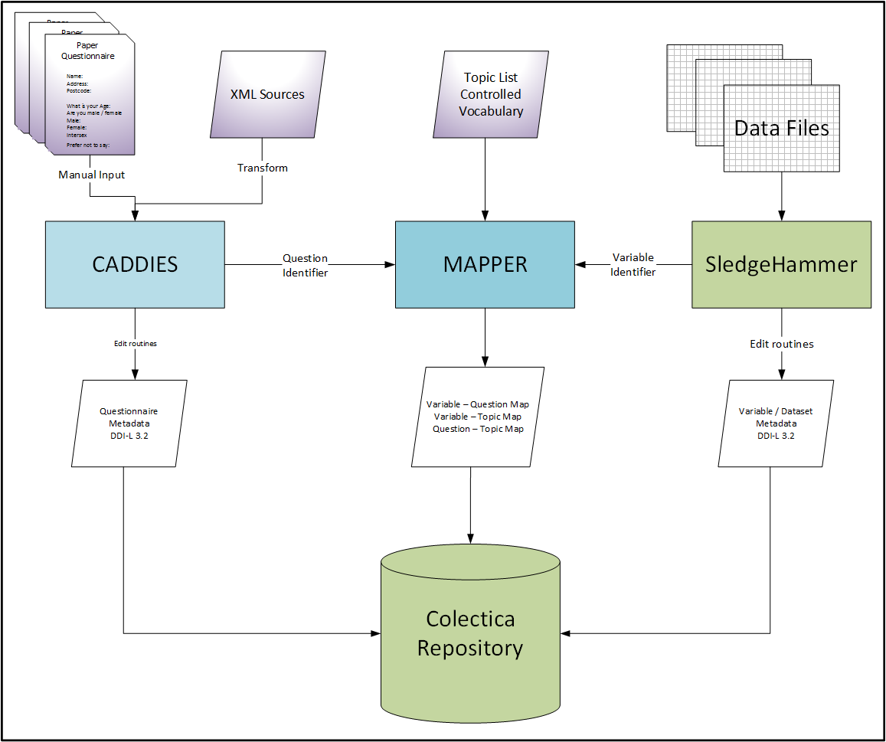
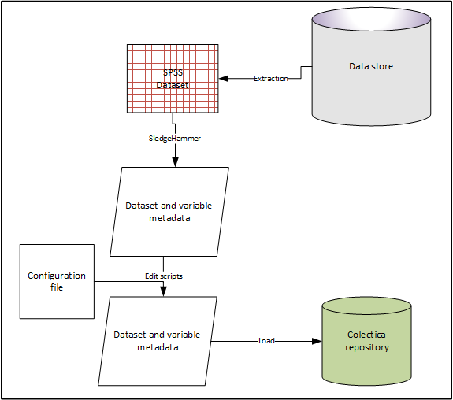

Processing Datasets
=====================

Overview
----------

The aim of this guide is to illustrate the workflow and details of variable metadata capture for later use in the CLOSER Search Platform.
Workflow

This diagram illustrates the overall workflow of the project. It relies on four key technologies, CADDIES for the creation of questionnaire metadata, SledgeHammer to extract from datasets all the available metadata and MAPPER to create the links between them and add in topics that are consistent between the question(s) and variable(s) and Colectica Repository for storage and further manipulation.
**Figure 1- CLOSER Project Workflow**

|figure1|

In keeping with our design philosophy of simple inputs and simple outputs, the definition of each component is strictly controlled.

DDI is a flexible standard and different users are at will to implement the standard in slightly different ways. This is a strength, but when moving between different implementations some adjustments need to be made.

Data files should meet certain criteria, this generates a standard SledgeHammer output, which is then lightly edited to provide a consistent structure for ingest into Colectica Repository.

**Figure 2- Variable Workflow**

|figure2|

Data Files
------------

Studies should be encouraged to generate data files that are of the standards the UK Data Service

- use meaningful and self-explanatory variable names, codes and abbreviations
- variable and value labels must be clear and consistent, avoiding truncation of variable and value labels
- non-compliant characters, such as &, @ and <>, should be removed
- ensure no repetition of variables, especially redundancy in derived variables
- ensure consistent treatment and labelling of missing values
- extraneous information such Document entries should be stripped out

The workflow see [Building the Repository Guide], expects a simple mapping of dataset to questionnaire. The naming of the datafile should be consistent with that of the questionnaire it is collected from.

Data files should ideally be in SPSS format. Some guidance on SPSS file preparation is given below.

Use of SledgeHammer
---------------------

SledgeHammer is a product released by Metadata Technology (North America) and allows the extraction of metadata from a wide range of data formats. Although it can be run interactively, the project uses batch files to allow a consistent generation of output

The project uses a restricted set of these commands

================== =========================== ========================================================================
Command            Examples                    Explanation
================== =========================== ========================================================================
-ag                uk.cls.mcs, uk.alspac       Agency
-rename            alspac_00_ayc nshd_46_tcs   This should be the name of the bundle with which the data is associated
-ddi               Always 3.2-RP               DDI Version - this should not be changed
-ddipd             Always proprietary          Only output proprietary format not ascii
-har               "No options"                This creates unified codelists i.e. single Yes/No
-ddilang           Always en-GB                This should stay as en-GB as this is the default setting we will be using
-ddiref            Always URN                  Internal ddi URN definition
-ddiurn            Always canonical            Canonical - this should not be changed
-pretty            "No options"                This is so it looks half decent if you look at by hand
-stats             min, max, valid, invalid    Description of statistics generated per variable Optional: stddev and freq
-opt               Always full                 Optimised output
-scan              "No options"                Outputs metadata or entire full and includes no of cases and variables
..                 ../bcs70/bcs_1970.sav       Name and path of input data file This is always the last line
================== =========================== ========================================================================

Batch File
------------

Each dataset should have a batch or command file which calls the sledgehammer-cl.bat file, and lists the options above
An example is::

  sledgehammer-cl.bat" ^
  -ag uk.cls.bcs70        ^
  -rename bcs_75_mcs ^
  -ddi 3.2-RP               ^
  -ddipd proprietary ^
  -har                ^
  -ddilang en-GB        ^
  -ddiref urn	^
  -ddiurn canonical ^
  -pretty      ^
  -opt full ^
  -scan ^
  -stats max,min,mean,mode,valid,invalid,freq,stdev ^
  ../bcs70/bcs_1975/bcs_1975_masc.sav

Metadata Edits
---------------

For display purposes and for ease of navigation and ingest, a consistent set of names should be applied to the output from SledgeHammer prior to ingest through a series of edit scripts. These are written in python, and if they cannot be run at the study, can be run at CLOSER prior to ingest.
Short Name - is the name of the metadata bundle with which the dataset of associated with
Long Name - the name you want to display as a human readable description
DOI - if available, this allows the user to navigate to the DOI and relevant citation and is provided for the user
Public - 1 is public 0 is not public
An example of this file is shown below

============== ====================================  ========================================       ========
Short name     Long Name                             DOI                                            Public
============== ====================================  ========================================       ========
mcs_03_na      MCS2 Neighbourhood Assessment         http://dx.doi.org/10.5255/UKDA-SN-5350-3       1
mcs4_teacher   MCS4 Teacher Survey                   http://dx.doi.org/10.5255/UKDA-SN-6848-1       1
mcs5_sc        MCS5 Child Paper Self-Completion      http://dx.doi.org/10.5255/UKDA-SN-7464-2       1
mcs5_teacher   MCS5 Teacher Survey                   http://dx.doi.org/10.5255/UKDA-SN-7464-2       1
ncds8_sc       NCDS8 Paper Self-Completion           http://dx.doi.org/10.5255/UKDA-SN-6137-2       1
pms            Perinatal Mortality Study             http://dx.doi.org/10.5255/UKDA-SN-5565-2       1
============== ====================================  ========================================       ========

This should be a tab delimited file called rename_list.txt

==============   ===============================================
Edit script      Explanation
==============   ===============================================
fandr.py         Insert <r:String> where absent from output
fandr2.py        Names the DDI Instance
fandr3.py        Names the Physical Instance
fandr4.py        Names the Logical Product
fandr5.py        Names the Code List scheme
fandr6.py        Names the Data Product Name
fandr7.py        Add Dataset URI and whether public
fandr8.py        Adds Title and Alternate Title to DDI Instance
fandr9.py        Corrects Valid to be ValidCases
fandr10.py       Corrects Invalid to be InvalidCases
==============   ===============================================

Control File
-----------------

A control file can be used to batch up the batch files and then run the edits across all the files::

  call pms.bat
  call ncds8_sc.bat
  call mcs_03_na.bat
  call bcs_1970.bat
  call mcs4_teacher.bat
  call mcs5_teacher.bat
  call mcs5_sc.bat
  call bcs_75_mcs.bat
  python g://db//bin//fandr.py
  python g://db//bin//fandr2.py
  python g://db//bin//fandr3.py
  python g://db//bin//fandr4.py
  python g://db//bin//fandr5.py
  python g://db//bin//fandr6.py
  python g://db//bin//fandr7.py
  python g://db//bin//fandr8.py
  python g://db//bin//fandr9.py
  python g://db//bin//fandr10.py

Outputs
---------

For each dataset a DDI 3.2 file called [shortname].ddi32.rp.xml will be generated.

Checking
------------

If the edits are run, the file can be imported into Colectica Designer to check that it is well formed.

SPSS File Preparation
-------------------------

SPSS will hold lots of hidden information, Sledgehammer wil try to use this and can lead to issues when outputting the DDI-L XML.
We would recommend using something like this to get rid of this extraneous information
This replaces a file label (often the location of the original file) with the bundle name, and to drop any document(s)::

  get file="G:\DB\closer_data\bcs70\bcs_1975\bcs_1975_masc.sav".
  FILE LABEL "bcs_75_msc".
  DROP DOCUMENT.
  EXECUTE.
  sysfile info file="G:\DB\closer_data\bcs70\bcs_1975\bcs_1975_masc.sav".
  save outfile="G:\DB\closer_data\bcs70\bcs_1975\bcs_1975_masc.sav".

References
--------------

SledgeHammer Technical User Guide (http://www.openmetadata.org/site/?page_id=1089)
